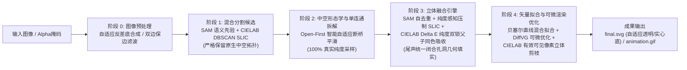

# VISTA: 图像语义分割与可微渲染矢量化算法框架

[](https://www.python.org/downloads/)
[](https://pytorch.org/)
[](LICENSE)

## 项目简介 (Overview)


> **VISTA (Vectorization using Image Segmentation and Tuned Optimization Algorithm)** 是一个通用的端到端图像矢量化算法框架。它深度融合了**自顶向下的语义分割先验 (SAM)** 与**自底向上的超像素聚类 (SLIC)**，配合**队列式孔洞提取与单连通拆解**、**纯度感知直接父级同色吸收**，并在**混合三阶贝塞尔几何拟合**与 **DiffVG 可微渲染优化**的驱动下，解决了传统矢量化方法在复杂场景下形状冗余、拓扑混乱、控制点过密以及难以编辑的问题，能够生成分层清晰、紧凑高保真、拓扑优雅且天然可编辑的标准 SVG 矢量图形。

---

## 核心流程 (Pipeline Workflow)

VISTA 的全流水线包含以下解耦的核心阶段：



1. **阶段 0：输入与图像预处理 (`utils.load_and_resize`, `utils.save_target_image`)**
   - 自动检测并提取原生 Alpha 透明通道（RGBA / Palette P 调色板），支持自适应反差色底合成与原生前景轮廓注入；
   - 可选双边保边滤波去噪（Bilateral Filter），消除 JPEG 块效应与细微噪点；
   - 依据配置进行等比例高质量缩放（保持宽高比），并准确提取画布全局背景色。

2. **阶段 1：原始候选留洞提取 (`segmentation.get_raw_slic_proposals`, `segmentation.get_raw_sam_proposals`)**
   - **自适应 SLIC 路由**：根据分辨率自适应网格密度，在 CIELAB 感知均匀色彩空间下执行 DBSCAN 聚类并结合凸缺陷平滑，严格保留内部中空拓扑；
   - **SAM 路由**：利用 `SamAutomaticMaskGenerator` 提取多尺度语义掩码，同样严格保留内部拓扑镂空；
   - 输出 `raw_slic_masks/` 与 `raw_sam_masks/`。

3. **阶段 2：原生中空形态学平滑与单连通拆解 (`segmentation.process_morphology_keep_holes`)**
   - 采用 **Open-First 智能多尺度自适应核算法**：优先通过自适应开运算（MORPH_OPEN）精准切断超像素或聚类微弱粘连桥，再对独立组件内部微小平滑；
   - 拆解为独立的单连通图层（Single Connected Components），**全程保留原生中空拓扑采样**，确保采集到的色彩标准差（`homogeneity_std`）100% 真实，不受空洞杂色污染；
   - 输出至 `origin_masks/`。

4. **阶段 3：立体分层融合与 CIELAB 纯度双锁同色吸收 (`segmentation.perform_fusion_and_save`)**
   - **SAM 内部高精度自去重**：抑制 IoU > 0.90 的同源重叠图层；
   - **纯度感知跨界压制 SLIC**：基于 IoU、包含率、色差与 SAM 纯度守门员机制，杜绝 SLIC 在纯色大块内的坑洼碎片冗余；
   - **全局背景层 0 插入**：构建 `000_bg.png` 承接整图底色；
   - **CIELAB 纯度双锁父子同色吸收**：在人眼感知均匀的 CIELAB $\Delta E$ 色彩空间下执行同色吸收，配合“自身纯度锁 (`self_pure_std_thresh`)”与“父级纯度锁 (`parent_pure_std_thresh`)”，既保证同色冗余干净吸收，又杜绝误杀复合容器内的独立细节；
   - **后置孔洞填实 (Late Hole-Filling)**：在融合筛选定型后，对最终存活图层统一调用 `_fill_holes` 闭合填实，输出至 `pre_masks/`，为阶段 4 贝塞尔拟合提供闭合实心几何底盘。

5. **阶段 4：直接矢量化、DiffVG 可微渲染优化与立体剪枝 (`vectorize.generate_init_svg`, `vectorize.svg_optimize`)**
   - **混合几何拟合**：以最少的三阶贝塞尔曲线和直线段贪婪拟合轮廓；
   - **主优化**：基于 DiffVG 可微渲染器与 Adam 优化器，联合优化控制点坐标与填充颜色，引入共线平滑（Collinear Handle Loss）与自相交惩罚；
   - **CIELAB 感知立体剪枝与短精修**：重新光栅化优化后的几何图层，基于 CIELAB $\Delta E$ 感知色差、自底向上图层遮挡有效可见像素分析（Visible Pixel Map），彻底清除贴边同色碎屑，随后执行短轮次精修（Refine）；
   - **自适应背景导出**：原图透明则自动导出天然无背景的纯净 SVG，原图有底色则完整保留背景底盘。

---

## 环境配置 (Environment Setup & Installation)

推荐在 Linux 环境下使用 Conda 进行环境隔离配置：

### 1. 创建 Conda 虚拟环境

```bash
git clone https://github.com/Muyi3927/Vista_V2.git
cd Vista_V2

conda create -n vista python=3.10 -y
conda activate vista
```

### 2. 安装 PyTorch (带 CUDA 支持)

```bash
# 推荐安装 PyTorch 1.13.1 (CUDA 11.7)，兼容 DiffVG 构建
conda install pytorch==1.13.1 torchvision==0.14.1 torchaudio==0.13.1 pytorch-cuda=11.7 -c pytorch -c nvidia -y
```

### 3. 安装 DiffVG 可微渲染器

```bash
git clone https://github.com/BachiLi/diffvg.git
cd diffvg
git submodule update --init --recursive
# PyTorch 1.13.1 与新版 MKL 存在兼容性问题
conda install -y "mkl=2023.1" "intel-openmp=2023.1"
# Basic dependencies
conda install -y numpy scikit-image
# diffvg build dependencies
conda install -y -c conda-forge "cmake=3.27"
conda install -y -c conda-forge ffmpeg
# Python dependencies
pip install svgwrite svgpathtools cssutils numba torch-tools visdom
# Build diffvg
python setup.py install
cd ..
```

### 4. 安装其余 Python 依赖

```bash
pip install -r requirements.txt
```

---

## 模型权重下载 (Model Checkpoints)

VISTA 默认启用 SAM 语义分割先验，请下载官方 ViT-H 权重文件：

```bash
mkdir -p checkpoints
wget -P checkpoints/ https://dl.fbaipublicfiles.com/segment_anything/sam_vit_h_4b8939.pth
```

> **提示**：权重下载完成后，请确保 [config/default.yaml](file:///home/jh/research/projects/VISTA_dev/VISTA/config/default.yaml) 中的 `paths.sam_checkpoint` 指向该权重路径（如 `checkpoints/sam_vit_h_4b8939.pth` 或绝对路径）。

---

## 使用方法 (Usage Guide)

### 方式一：命令行运行（配置驱动，支持单图与文件夹批量）

1. 修改配置文件 [config/default.yaml](file:///home/jh/research/projects/VISTA_dev/VISTA/config/default.yaml)：
   ```yaml
   paths:
     input: dataset/tmp              # 单张图像路径，或包含多张图像的文件夹路径
     output: out/run                 # 运行过程及中间结果输出总目录
     sam_checkpoint: checkpoints/sam_vit_h_4b8939.pth
   
   run:
     mode: auto                      # auto(根据输入自动判断) / image(单图) / folder(批量)
   ```

2. 运行主程序：
   ```bash
   cd src
   python vista_main.py
   ```

3. 运行完成后：
   - 最终 SVG 与动画自动归档于 `out/run/final_out/`；
   - 详细的分阶段中间掩码与调试文件保存在 `out/run/[图像名]_[UUID]/`。

---

### 方式二：Web 交互式可视化工作台 (Interactive Web Studio)

VISTA 提供了两种可视化交互界面供选择：

1. **现代化 FastAPI Web 工作台（推荐）**：
   ```bash
   cd src
   python app.py
   ```
   启动后在浏览器中打开：`http://127.0.0.1:8001`
   - **特点**：支持拖拽上传、三套快速预设（快速预览/标准平衡/高保真）、全流程参数折叠卡片、左右双屏并排对比、演化动画点播、全阶段全景图看板、单图层画廊、指标实时统计与 SVG/GIF 一键下载。

2. **Gradio 独立分步调试工作台**：
   ```bash
   cd src
   python studio.py
   ```
   启动后在浏览器中打开：`http://127.0.0.1:7860`
   - **特点**：采用多 Tab 分步调试工作流（1. 图像输入与尺寸设置 → 2. SAM+SLIC 分割与图层融合调试看板 → 3. 几何拟合与 DiffVG 优化）。

---

### 方式三：作为 Python 模块在代码中调用

```python
import sys
sys.path.append("src")

from pipeline import process_single_image
from config import load_config

# 加载默认配置并进行运行时参数自定义覆盖
cfg = load_config(overrides={
    "paths": {"sam_checkpoint": "checkpoints/sam_vit_h_4b8939.pth"},
    "preprocess": {"target_size": 0},
    "optimize": {"num_iters": 1000}
})

summary = process_single_image(
    image_path="dataset/emoji_1.png",
    base_out_dir="out/run",
    final_out_dir="out/run/final_out",
    cfg=cfg
)

print(f"矢量化成功！SVG 路径: {summary['vectorize']['svg_path']}")
print(f"总耗时: {summary['total_time_sec']}s, 路径数: {summary['vectorize']['shapes']}, MSE: {summary['vectorize']['mse_loss']}")
```

---

## 规范化输出目录结构 (Output Directory Structure)

每次运行会在输出目录下为每张图像生成清晰解耦、分阶段归档的独立工作空间：

```text
outputs/[图像名]_[随机6位ID]/
│
├── target_img/                       # 阶段 0：预处理后目标图（透明底合成/等比缩放）
│
│   # ----------------- 【三大标准阶段掩码与真彩画廊】 -----------------
├── raw_sam_masks/ & raw_slic_masks/  # 【第 1 阶段：原生分割候选】（严格保留原生中空拓扑）
│   ├── raw_sam_colored_masks/        # SAM 原生候选真彩掩码
│   ├── raw_slic_colored_masks/       # SLIC 原生超像素真彩掩码
│   ├── sam_overview_colored.png      # SAM 原生候选全景预览彩图
│   └── slic_overview_colored.png     # SLIC 原生候选全景预览彩图
│
├── origin_masks/                     # 【第 2 阶段：单连通拆解 + 智能断桥平滑】（保持原生中空采样）
│   ├── origin_colored_masks/         # 拆解后的单连通真彩掩码（文件名反映面积a与纯度s）
│   └── origin_overview_colored.png   # 连通拆分后全景预览彩图
│
├── pre_masks/                        # 【第 3 阶段：预处理完成终极图层】（纯度融合+尾声填洞实心化）
│   ├── pre_colored_masks/            # 最终图层真彩掩码（严格按实心面积 solid_area 降序排列）
│   ├── pre_overview_colored.png      # 最终精简分层全景预览彩图
│   └── pre_masks_meta.json           # 最终图层元数据 JSON（面积、RGB色值、色彩方差、来源）
│
│   # ----------------- 【阶段 4 矢量化与可微渲染输出】 -----------------
├── init_svgs/                        # 阶段 4：各图层单体贝塞尔拟合 SVG 与初始组合 SVG
├── optim_svgs/                       # 阶段 4：DiffVG 优化中间迭代过程 SVG (opt_iter_*.svg)
│
├── final.svg                         # 最终优化与剪枝后的标准 SVG 矢量成果文件 (自适应透明底/实心底)
├── animation.gif                     # 矢量化动态优化全过程动画 (GIF)
├── init.svg                          # 初始未优化的全图 SVG
├── op_final.svg                      # 主优化完成（剪枝前）SVG
├── after_prune.svg                   # CIELAB 立体剪枝后 SVG
├── decision_log.json                 # 【全流程决策日志】记录图层移除、同色吸收原因与阶段4几何剪枝明细
└── result.json                       # 本次运行全阶段耗时、点数、损失统计报告
```

---

## 代码仓库架构 (Codebase Architecture)

```text
VISTA/
├── config/
│   └── default.yaml         # 统一超参数与路径配置（包含分割、形态学、优化及保存开关）
├── src/
│   ├── config.py            # YAML 配置文件解析与设备分配管理
│   ├── utils.py             # 图像加载透明合成、背景色聚类、共线损失等通用工具
│   ├── segmentation.py      # SAM + SLIC 候选分割、孔洞实心化、单连通拆解与分层融合引擎
│   ├── vectorize.py         # 混合贝塞尔轮廓拟合、DiffVG 优化循环与几何占用剪枝
│   ├── pipeline.py          # 解耦的端到端单图流水线组装调度模块
│   ├── vista_main.py        # 命令行批量/单图主执行入口
│   ├── app_main.py          # Web API 运行时参数包装接口
│   └── app.py               # FastAPI 交互式 Web 服务
├── static/                  # Web Studio 静态前端（HTML/CSS/JavaScript）
├── dataset/                 # 示例测试图像数据集
├── requirements.txt         # Python 依赖清单
└── README.md                # 项目文档
```

---

## 开源许可 (License)

本项目基于 [MIT License](LICENSE) 开源协议发布。您可以自由地在学术研究、个人学习以及商业项目中分发、修改与使用本项目的源代码与衍生作品。

