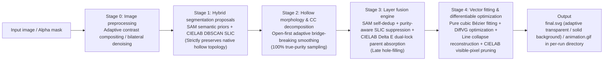

# VISTA: Image Semantic Segmentation & Differentiable Rendering Vectorization Framework

[](https://www.python.org/downloads/)
[](https://pytorch.org/)
[](LICENSE)

[**中文文档**](README.md) | [**English Documentation**](README_EN.md)

## Overview

> **VISTA (Vectorization using Image Segmentation and Tuned Optimization Algorithm)** is a general-purpose end-to-end image vectorization framework. It combines **top-down semantic segmentation priors (SAM)** and **bottom-up superpixel clustering (SLIC)**, together with **queue-based hole extraction and single connected component decomposition**, **purity-aware direct parent color absorption**, and is driven by **pure cubic Bézier fitting**, **post-optimization line collapse reconstruction**, and **DiffVG differentiable rendering optimization**. VISTA addresses traditional vectorization issues such as redundant shapes, tangled topology, over-dense control points, and difficult editing, generating structured, compact, high-fidelity, and naturally editable standard SVG vector graphics.

---

## Pipeline Workflow

The complete VISTA pipeline contains the following decoupled core stages:



1. **Stage 0: Input and image preprocessing (`utils.load_and_resize`, `utils.save_target_image`)**
   - Automatically detects and extracts native alpha transparency channels (RGBA / palette P), supporting adaptive contrast background compositing and native foreground outline injection.
   - Optional bilateral filtering denoising removes JPEG artifacts and fine noise while preserving sharp edges.
   - Proportional high-quality resizing is performed according to the configuration while preserving aspect ratio, and the global canvas background is extracted accurately.

2. **Stage 1: Raw proposal extraction with topology preservation (`segmentation.get_raw_slic_proposals`, `segmentation.get_raw_sam_proposals`)**
   - **Adaptive SLIC route**: adapts grid density based on resolution, performs DBSCAN clustering in the perceptually uniform CIELAB color space, and strictly preserves internal hollow topology.
   - **SAM route**: uses `SamAutomaticMaskGenerator` to extract multi-scale semantic masks while also preserving hollow structures.
   - Outputs are stored in `raw_slic_masks/` and `raw_sam_masks/`.

3. **Stage 2: Native hollow morphology smoothing and single connected-component decomposition (`segmentation.process_morphology_keep_holes`)**
   - Uses an **open-first adaptive multi-scale kernel algorithm**: it first performs adaptive morphological opening (MORPH_OPEN) to precisely sever weak bridges between superpixels or clusters, followed by micro-smoothing on isolated components.
   - Decomposes the image into independent single connected components while **preserving hollow topological sampling throughout**, ensuring the captured color variance (`homogeneity_std`) remains 100% authentic and unaffected by hollow noise.
   - Outputs are written to `origin_masks/`.

4. **Stage 3: Layer fusion and CIELAB dual-lock color absorption (`segmentation.perform_fusion_and_save`)**
   - **SAM self-deduplication**: suppresses overlapping sibling layers with IoU > 0.90.
   - **Purity-aware SLIC suppression**: removes redundant SLIC fragments in large flat-color regions, with high-quality SAM replacing them when the symmetric IoU is greater than or equal to 0.90.
   - **Global background layer injection**: constructs `000_bg.png` as the canvas base layer.
   - **CIELAB dual-lock parent absorption**: performs same-color absorption in perceptually uniform CIELAB ΔE space, protected by a “self purity lock” and a “parent purity lock,” preventing accidental removal of independent details in compound containers.
   - **Late hole-filling**: after aggregation is finalized, surviving layers are closed and filled to generate solid base shapes and produce final `pre_masks/` inputs for the vectorization stage.

5. **Stage 4: Pure cubic Bézier fitting, DiffVG optimization, and geometric pruning (`vectorize.generate_init_svg`, `vectorize.svg_optimize`)**
   - **Pure cubic Bézier fitting**: every segment is fit with cubic Bézier control points (P1, P2) via least squares, giving the initial path maximum deformation freedom.
   - **Adaptive point spacing and tolerance**: based on layer area ratio, the system adjusts tolerance and sampling distance to keep large regions smooth while preserving small details such as eyes.
   - **Main optimization and geometric line reconstruction**: uses DiffVG to optimize coordinates and colors, then automatically collapses near-straight segments into strict line segments to remove redundant control points after convergence.
   - **Visual blended CIELAB ΔE pruning and refinement**: re-rasterizes geometric layers and prunes low-contribution same-color fragments based on real alpha compositing, visible pixels, and occlusion-aware analysis, followed by a short refinement pass.
   - **Adaptive background export**: transparent inputs export background-free SVG; solid inputs preserve the background rectangle.

---

## Environment Setup & Installation

Linux with Conda environment isolation is recommended:

### 1. Create a Conda virtual environment

```bash
git clone https://github.com/Muyi3927/Vista_V2.git
cd Vista_V2

conda create -n vista python=3.10 -y
conda activate vista
```

### 2. Install PyTorch with CUDA support

```bash
# PyTorch 1.13.1 (CUDA 11.7) is recommended for DiffVG compatibility
conda install pytorch==1.13.1 torchvision==0.14.1 torchaudio==0.13.1 pytorch-cuda=11.7 -c pytorch -c nvidia -y
```

### 3. Install the DiffVG differentiable renderer

```bash
git clone https://github.com/BachiLi/diffvg.git
cd diffvg
git submodule update --init --recursive
# Resolve MKL compatibility issues with PyTorch 1.13.1
conda install -y "mkl=2023.1" "intel-openmp=2023.1"
# Basic dependencies
conda install -y numpy scikit-image
# diffvg build dependencies
conda install -y -c conda-forge "cmake=3.27"
conda install -y -c conda-forge ffmpeg
# Python dependencies
pip install svgwrite svgpathtools cssutils numba torch-tools visdom
# Build diffvg
python setup.py install
cd ..
```

### 4. Install remaining Python dependencies

```bash
pip install -r requirements.txt
```

---

## Model Checkpoints

VISTA uses the SAM ViT-H checkpoint by default. Please download the official weights:

```bash
mkdir -p checkpoints
wget -P checkpoints/ https://dl.fbaipublicfiles.com/segment_anything/sam_vit_h_4b8939.pth
```

> **Note**: After downloading, make sure `paths.sam_checkpoint` in [config/default.yaml](config/default.yaml) points to the downloaded weight path.

---

## Usage Guide

### Method 1: Command-line interface (config-driven, single image and batch mode)

1. Edit the configuration in [config/default.yaml](config/default.yaml):
   ```yaml
   paths:
     input: dataset/tmp              # Single image or folder containing multiple images
     output: out/run                 # Root directory for results
     sam_checkpoint: checkpoints/sam_vit_h_4b8939.pth
   
   run:
     mode: auto                      # auto / image / folder
   ```

2. Run the main script:
   ```bash
   cd src
   python vista_main.py
   ```

3. Results after execution:
   - Final SVG files are stored in `out/run/final_out/`.
   - Stage masks, logs, and per-run outputs are saved under `out/run/[image_name]_[UUID]/`.

---

### Method 2: Web interactive visualization studio

VISTA provides two interactive visualization interfaces:

1. **Modern FastAPI web studio (recommended)**:
   ```bash
   cd src
   python app.py
   ```
   Open the browser at: `http://127.0.0.1:8001`
   - **Features**: drag-and-drop upload, three preset modes (quick preview / balanced / high fidelity), collapsible full-pipeline parameter cards, side-by-side comparison, animation playback, full-stage overview panels, layer gallery, live metrics, and one-click SVG/GIF download.

2. **Gradio standalone debugging studio**:
   ```bash
   cd src
   python studio.py
   ```
   Open the browser at: `http://127.0.0.1:7860`
   - **Features**: multi-tab step-by-step debugging workflow (1. image input and size settings → 2. SAM+SLIC segmentation and fusion panels → 3. geometry fitting and DiffVG optimization).

---

### Method 3: Python API integration

```python
import sys
sys.path.append("src")

from pipeline import process_single_image
from config import load_config

cfg = load_config(overrides={
    "paths": {"sam_checkpoint": "checkpoints/sam_vit_h_4b8939.pth"},
    "preprocess": {"target_size": 0},
    "optimize": {"num_iters": 1000}
})

summary = process_single_image(
    image_path="dataset/sample.png",
    base_out_dir="out/run",
    final_out_dir="out/run/final_out",
    cfg=cfg
)

print(f"Vectorization succeeded! SVG path: {summary['vectorize']['svg_path']}")
print(f"Shapes: {summary['vectorize']['shapes']}, total points: {summary['vectorize']['path_point_nums']}, MSE: {summary['vectorize']['mse_loss']}")
```

---

## Output Directory Structure

Each execution creates an isolated, staged working directory:

```text
outputs/[image_name]_[UUID]/
│
├── target_img/                       # Stage 0: Preprocessed target image
│
├── raw_sam_masks/ & raw_slic_masks/  # Stage 1: Raw proposals (hollow preserved)
│   ├── raw_sam_colored_masks/
│   ├── raw_slic_colored_masks/
│   ├── sam_overview_colored.png
│   └── slic_overview_colored.png
│
├── origin_masks/                     # Stage 2: Single connected components and morphological smoothing
│   ├── origin_colored_masks/
│   └── origin_overview_colored.png
│
├── pre_masks/                        # Stage 3: Final fused layers (purity-filtered and hole-filled)
│   ├── pre_colored_masks/
│   ├── pre_overview_colored.png
│   └── pre_masks_meta.json
│
├── init_svgs/                        # Stage 4: Initial per-layer Bézier SVGs
├── optim_svgs/                       # Stage 4: Intermediate DiffVG optimization snapshots
│
├── final.svg                         # Final optimized and pruned SVG
├── animation.gif                     # Optimization evolution GIF (stored in the per-run directory)
├── init.svg                          # Initial unoptimized full SVG
├── op_final.svg                      # Post-main-optimization SVG (before pruning)
├── after_prune.svg                   # Post-pruning SVG
├── decision_log.json                 # Full decision log for layer removals and pruning reasons
└── result.json                       # Execution timing, loss, and shape statistics
```

And the final collection directory is normalized as:

```text
out/run/final_out/
├── sample.svg
├── sample2.svg
└── ...
```

> Final output directories store only the final SVG files; GIF animations remain in the per-run working directory and are not copied into `final_out`.

---

## Codebase Architecture

```text
VISTA/
├── config/
│   └── default.yaml         # Unified hyperparameters and path configuration
├── src/
│   ├── config.py            # YAML parsing and device assignment management
│   ├── utils.py             # Image loading, alpha compositing, background color extraction, and utility functions
│   ├── segmentation.py      # SAM + SLIC proposal generation, hole-filling, CC decomposition, and layer fusion
│   ├── vectorize.py         # Mixed Bézier fitting, DiffVG optimization loops, and geometric pruning
│   ├── pipeline.py          # End-to-end single-image pipeline orchestration
│   ├── vista_main.py        # CLI entry point for single or batch execution
│   ├── app_main.py          # Web API parameter wrapper
│   └── app.py               # FastAPI interactive web service
├── static/                  # Web studio front-end assets (HTML/CSS/JS)
├── dataset/                 # Example test images
├── requirements.txt         # Python dependency list
├── README.md                # Chinese project documentation
├── README_EN.md             # English project documentation
└── LICENSE                  # Project license
```

---

## License

This project is licensed under the [MIT License](LICENSE).
