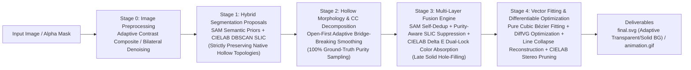

# VISTA: Image Semantic Segmentation & Differentiable Rendering Vectorization Framework

[](https://www.python.org/downloads/)
[](https://pytorch.org/)
[](LICENSE)

[**中文文档**](README.md) | [**English Documentation**](README_EN.md)

## Overview

> **VISTA (Vectorization using Image Segmentation and Tuned Optimization Algorithm)** is a universal end-to-end image vectorization algorithm framework. It deeply integrates **top-down semantic segmentation priors (SAM)** with **bottom-up superpixel clustering (SLIC)**, paired with **queue-based hole extraction and single-connected component decomposition**, **purity-aware direct parent color absorption**, and is driven by **pure cubic Bézier geometric fitting**, **post-optimization line collapse reconstruction**, and **DiffVG differentiable rendering optimization**. VISTA solves traditional vectorization challenges such as redundant shapes, disorganized topologies, over-dense control points, and editing difficulties, producing structured, compact, high-fidelity, and naturally editable standard SVG vector graphics.

---

## Pipeline Workflow

The complete VISTA pipeline consists of decoupled core stages:



1. **Stage 0: Input & Image Preprocessing (`utils.load_and_resize`, `utils.save_target_image`)**
   - Automatically detects and extracts native Alpha transparency channels (RGBA / Palette P), supporting adaptive contrast background compositing and native foreground outline injection.
   - Optional Bilateral Filter denoising to remove JPEG artifacts and fine noise while preserving sharp edges.
   - Proportional high-quality resizing with canvas background color extraction.

2. **Stage 1: Raw Proposal Extraction with Topology Preservation (`segmentation.get_raw_slic_proposals`, `segmentation.get_raw_sam_proposals`)**
   - **Adaptive SLIC Route**: Automatically adapts grid density to resolution, performs DBSCAN clustering in the perceptually uniform CIELAB color space, and strictly preserves inner hollow topologies.
   - **SAM Route**: Utilizes `SamAutomaticMaskGenerator` for multi-scale semantic masks, also strictly preserving inner hollow structures.
   - Outputs to `raw_slic_masks/` and `raw_sam_masks/`.

3. **Stage 2: Native Hollow Morphology Smoothing & CC Decomposition (`segmentation.process_morphology_keep_holes`)**
   - Employs an **Open-First adaptive kernel algorithm**: Prioritizes adaptive morphological opening (MORPH_OPEN) to precisely sever weak superpixel bridges, followed by micro-smoothing on isolated components.
   - Decomposes into independent Single Connected Components while **preserving hollow topology sampling throughout**, ensuring 100% authentic color variance (`homogeneity_std`).
   - Outputs to `origin_masks/`.

4. **Stage 3: Multi-Layer Fusion & CIELAB Dual-Lock Color Absorption (`segmentation.perform_fusion_and_save`)**
   - **SAM Self-Deduplication**: Suppresses overlapping sibling layers with $\text{IoU} > 0.90$.
   - **Purity-Aware SLIC Suppression**: Eliminates redundant SLIC fragments within large flat color regions (direct replacement by high-quality SAM when symmetric $\text{IoU} \ge 0.90$).
   - **Global Background Layer Injection**: Constructs `000_bg.png` to serve as the global canvas base.
   - **CIELAB Dual-Lock Color Absorption**: Performs color absorption in perceptually uniform CIELAB $\Delta E$ space, protected by "Self Purity Lock" and "Parent Purity Lock" to absorb color redundancies cleanly without hurting multi-object containers.
   - **Late Hole-Filling**: Fills and closes holes on surviving layers only after fusion decisions are finalized, outputting solid base layers to `pre_masks/`.

5. **Stage 4: Pure Cubic Bézier Fitting, DiffVG Optimization & Geometric Pruning (`vectorize.generate_init_svg`, `vectorize.svg_optimize`)**
   - **Pure Cubic Bézier Fitting**: Every segment fits cubic Bézier control points (P1, P2) via least squares, granting maximum continuous deformation freedom.
   - **Area-Adaptive Tolerance & Point Spacing**: Adaptively scales tolerances and sampling distance based on mask area ratio, ensuring sparse control points for large regions while preserving tiny details (e.g., eyes).
   - **Main Optimization & Geometric Line Reconstruction**: Optimizes control points and fill colors via Adam with DiffVG. Automatically collapses near-straight segments into strict line segments post-convergence to eliminate redundant control points.
   - **Visual Blended $\text{CIELAB } \Delta E$ Pruning & Refinement**: Re-rasterizes geometric layers and prunes low-contribution color-redundant fragments based on authentic Alpha visual blending and bottom-up occlusion visible pixel maps, followed by a short refine phase.
   - **Adaptive Background Export**: Transparent inputs export background-free SVG; solid inputs preserve the full background rectangle.

---

## Environment Setup & Installation

Linux with Conda environment isolation is recommended:

### 1. Create Conda Virtual Environment

```bash
git clone https://github.com/Muyi3927/Vista_V2.git
cd Vista_V2

conda create -n vista python=3.10 -y
conda activate vista
```

### 2. Install PyTorch with CUDA Support

```bash
# PyTorch 1.13.1 (CUDA 11.7) is recommended for DiffVG compatibility
conda install pytorch==1.13.1 torchvision==0.14.1 torchaudio==0.13.1 pytorch-cuda=11.7 -c pytorch -c nvidia -y
```

### 3. Install DiffVG Differentiable Renderer

```bash
git clone https://github.com/BachiLi/diffvg.git
cd diffvg
git submodule update --init --recursive
# Resolve MKL compatibility issues with PyTorch 1.13.1
conda install -y "mkl=2023.1" "intel-openmp=2023.1"
# Basic dependencies
conda install -y numpy scikit-image
# diffvg build dependencies
conda install -y -c conda-forge "cmake=3.27"
conda install -y -c conda-forge ffmpeg
# Python dependencies
pip install svgwrite svgpathtools cssutils numba torch-tools visdom
# Build diffvg
python setup.py install
cd ..
```

### 4. Install Remaining Python Dependencies

```bash
pip install -r requirements.txt
```

---

## Model Checkpoints

VISTA uses the SAM ViT-H checkpoint by default. Please download the official weights:

```bash
mkdir -p checkpoints
wget -P checkpoints/ https://dl.fbaipublicfiles.com/segment_anything/sam_vit_h_4b8939.pth
```

> **Note**: Ensure `paths.sam_checkpoint` in `config/default.yaml` points to your downloaded weight path.

---

## Usage Guide

### Method 1: Command Line Interface (Config-driven, Single Image & Batch)

1. Edit configuration in `config/default.yaml`:
   ```yaml
   paths:
     input: dataset/tmp              # Single image path or folder containing multiple images
     output: out/run                 # Root directory for results
     sam_checkpoint: checkpoints/sam_vit_h_4b8939.pth
   
   run:
     mode: auto                      # auto / image / folder
   ```

2. Run the main script:
   ```bash
   cd src
   python vista_main.py
   ```

3. Output deliverables:
   - Final SVGs and animations are organized under `out/run/final_out/`.
   - Stage masks and debug logs are saved in `out/run/[image_name]_[UUID]/`.

---

### Method 2: SVG Path & Control Point Complexity Analyzer

We provide a built-in analysis tool to inspect path counts, total control points, and average points per path:

```bash
# Analyze a single SVG
python count_svg_points.py out/run/final_out/sample.svg

# Batch scan a directory and export report
python count_svg_points.py out/run/final_out --pattern "*.svg" --csv report.csv
```

---

### Method 3: Python API Integration

```python
import sys
sys.path.append("src")

from pipeline import process_single_image
from config import load_config

# Load default config with runtime parameter overrides
cfg = load_config(overrides={
    "paths": {"sam_checkpoint": "checkpoints/sam_vit_h_4b8939.pth"},
    "preprocess": {"target_size": 1024},
    "optimize": {"num_iters": 1000}
})

summary = process_single_image(
    image_path="dataset/sample.png",
    base_out_dir="out/run",
    final_out_dir="out/run/final_out",
    cfg=cfg
)

print(f"Vectorization Succeeded! Output SVG: {summary['vectorize']['svg_path']}")
print(f"Shapes: {summary['vectorize']['shapes']}, Total Points: {summary['vectorize']['path_point_nums']}, MSE: {summary['vectorize']['mse_loss']}")
```

---

## Output Directory Structure

Each execution creates an isolated, staged workspace:

```text
outputs/[image_name]_[UUID]/
│
├── target_img/                       # Stage 0: Preprocessed target image
│
├── raw_sam_masks/ & raw_slic_masks/  # Stage 1: Raw proposals (Hollow preserved)
│   ├── raw_sam_colored_masks/
│   ├── raw_slic_colored_masks/
│   ├── sam_overview_colored.png
│   └── slic_overview_colored.png
│
├── origin_masks/                     # Stage 2: Single CCs & Morphological Smoothing
│   ├── origin_colored_masks/
│   └── origin_overview_colored.png
│
├── pre_masks/                        # Stage 3: Fused Layers (Purity filtered + Late filled)
│   ├── pre_colored_masks/            # Strictly sorted by solid area descending
│   ├── pre_overview_colored.png
│   └── pre_masks_meta.json
│
├── init_svgs/                        # Stage 4: Initial per-layer Bézier SVGs
├── optim_svgs/                       # Stage 4: Intermediate DiffVG optimization snapshots
│
├── final.svg                         # Final optimized and pruned SVG
├── animation.gif                     # Optimization evolution GIF
├── init.svg                          # Initial unoptimized full SVG
├── op_final.svg                      # Post-main optimization (pre-prune) SVG
├── after_prune.svg                   # Post-pruning SVG
├── decision_log.json                 # Comprehensive decision log for layer removals
└── result.json                       # Execution timing, loss, and shape statistics
```

---

## License

This project is licensed under the [MIT License](LICENSE).
